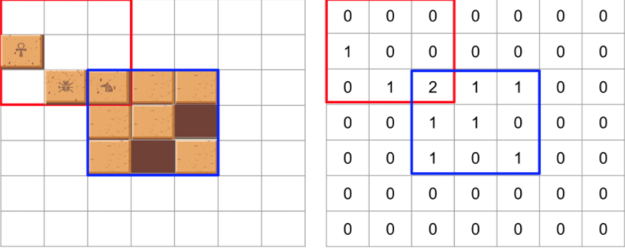

## 문제 설명
고고학자인 "튜브"는 고대 유적지에서 보물과 유적이 가득할 것으로 추정되는 비밀의 문을 발견하였습니다. 그런데 문을 열려고 살펴보니 특이한 형태의 자물쇠로 잠겨 있었고 문 앞에는 특이한 형태의 열쇠와 함께 자물쇠를 푸는 방법에 대해 다음과 같이 설명해 주는 종이가 발견되었습니다.

잠겨있는 자물쇠는 격자 한 칸의 크기가 1 x 1인 N x N 크기의 정사각 격자 형태이고 특이한 모양의 열쇠는 M x M 크기인 정사각 격자 형태로 되어 있습니다.

자물쇠에는 홈이 파여 있고 열쇠 또한 홈과 돌기 부분이 있습니다. 열쇠는 회전과 이동이 가능하며 열쇠의 돌기 부분을 자물쇠의 홈 부분에 딱 맞게 채우면 자물쇠가 열리게 되는 구조입니다. 자물쇠 영역을 벗어난 부분에 있는 열쇠의 홈과 돌기는 자물쇠를 여는 데 영향을 주지 않지만, 자물쇠 영역 내에서는 열쇠의 돌기 부분과 자물쇠의 홈 부분이 정확히 일치해야 하며 열쇠의 돌기와 자물쇠의 돌기가 만나서는 안됩니다. 또한 자물쇠의 모든 홈을 채워 비어있는 곳이 없어야 자물쇠를 열 수 있습니다.

열쇠를 나타내는 2차원 배열 key와 자물쇠를 나타내는 2차원 배열 lock이 매개변수로 주어질 때, 열쇠로 자물쇠를 열수 있으면 true를, 열 수 없으면 false를 return 하도록 solution 함수를 완성해주세요.

## 제한사항
key는 M x M(3 ≤ M ≤ 20, M은 자연수)크기 2차원 배열입니다.
lock은 N x N(3 ≤ N ≤ 20, N은 자연수)크기 2차원 배열입니다.
M은 항상 N 이하입니다.
key와 lock의 원소는 0 또는 1로 이루어져 있습니다.
0은 홈 부분, 1은 돌기 부분을 나타냅니다.
## 입출력 예
key	lock	                         result
[[0, 0, 0], [1, 0, 0], [0, 1, 1]]	[[1, 1, 1], [1, 1, 0], [1, 0, 1]]	true
-> key를 시계 방향으로 90도 회전, 오른쪽으로 한칸, 아래로 한 칸 이동하며 lock의 홈 부분을 정확히 모두 채울 수 있다.

### 문제  해결
- 자물쇠: n * n 크기의 정사각 겨자 형태
열쇠 : m*m 크기의 정사각 격자 형태
- 열쇠: 회전,이동 가능, 열쇠의 돌기 부분을 자물쇠의 홈 부분에 딱 맞게 채우면 자물쇠가 열리게 되는 구조. 

- lock 배열에 key배열을 (0,0)[lock배열 기준] 좌표에 맞춰 한칸씩 y,x로 이동하면서 빈칸을 맞춘다.만약 모든 좌표에 맞게 해도 안되면 key배열을 90도 돌려서 다시 동일하게 반복!
1. Lock 배열의 가로, 세로 3배의 background 배열을 생성, 중간에 Lock 배열값을 넣어준다.
2. background에 0, 0 부터 key배열을 더해준다.
3. background에 Lock영역에서 홈과 돌기가 모두 맞는지 확인. 모든값이 1이어야 함 (겹치는 부분은 2, 홈이면 0)
3-1. 홈과 돌기가 맞지 않는 경우 key의 좌표를 한칸씩 이동하면서 2번 반복
3-2. 모든 좌표를 반복하여 확인했을 때도 맞지 않는경우, Key 배열을 90도 돌려 2번 반복

