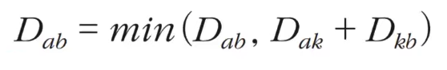

## 최단경로

### 가장 빠르게 도달하는 방법

- 최단경로 알고리즘: 가장 짧은 경로를 찾는 알고리즘
  따라서 길찾기 문제라고도 불린다.

### 예시

1. 한 지점에서 다른 특정 지점까지의 최단 경로를 구해야 하는 경우
2. 모든 지점에서 다른 모든 지점까지의 최단 경로를 모두 구해야 하는 경우

### 최단 경로 문제 풀이 과정

최단 경로 문제는 보통 그래프를 이용하여 표현한다. \
각 지점은 그래프에서 '노드'로 표현
지점간 연결된 도로는 그래프에서 '간선'으로 표현된다.

### 최단거리 알고리즘

- 다익스트라
- 플로이드 워셜

### 다익스트라 알고리즘

- 여러 개의 노드가 있을 때, 특정한 노드에서 출발하여 다른 노드로 가는 각각의 최단 경로를 구해주는 알고리즘이다.
- 1:1 알고리즘
- '음의 간선'이 없을 때 정상적으로 동작한다.
- GPS 소프트웨어의 기본 알고리즘으로 채택한다.

### 다익스트라 알고리즘 원리

1. 출발 노드 설정
2. 최단 거리 테이블 초기화
3. 방문하지 않은 노드 중에서 최단 거리가 가장 짧은 노드 선택
4. 해당 노드를 거쳐 다른 노드로 가는 비용을 게산하여 최단 거리 테이블 갱신
5. 위 과정에서 3과 4번을 반복

- 다익스트라 알고리즘은 최단 경로를 구하는 과정에서 `각 노드`에 대한 `현재까지의 최단 거리 정보`를 항상 1차원 리스트에 저장하며 리스트를 갱신해 나간다.
- 매번 현재 처리하고 있는 노드를 기준으로 주변 간선을 확인한다.

### 개선된 다익스트라 알고리즘

최단 거리가 가장 짧은 노드를 선택하는 과정을 다익스트라 최단 경로 함수 안에서 우선순위 큐를 이용하는 방식으로 대체한다. ->원래 get_smallest 함수부분을 heapq로 대체함

## 플로이드 워셜

모든 지점에서 다른 모든 지점까지의 최단 경로를 모두 구해야 하는 경우

### 플로이드 워셜 알고리즘 개요
- 모든 노드에서 다른 모든 노드까지의 최단 경로를 모두 계산한다

- 플로이드 워셜(Floyd-Warshall) 알고리즘은 다익스트라 알고리즘과 마찬가지로 단계별로 거쳐 가는 노드를 기준으로 알고리즘을 수행한다

- 다만 매 단계마다 방문하지 않은 노드 중에 최단 거리를 갖는 노드를 찾는 과정이 필요하지 않다

- 플로이드 워셜은 `2차원 테이블`에 최단 거리 정보를 저장한다

- 플로이드 워셜 알고리즘은 다`이나믹 프로그래밍 유형`에 속한다

- 각 단계마다 `특정한 노드 𝑘를 거쳐 `가는 경우를 확인한다

- `𝑎에서 𝑏로 가는 최단 거리`보다 `𝑎에서 𝑘를 거쳐 𝑏로 가는 거리`가 더 짧은지 검사한다

- 점화식:
