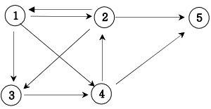

## 경로 탐색(그래프 DFS)

방향그래프가 주어지면 1번 정점에서 N번 정점으로 가는 모든 경로의 가지 수를 출력하는 프
로그램을 작성하세요. 아래 그래프에서 1번 정점에서 5번 정점으로 가는 가지 수는
1 2 3 4 5\
1 2 5\
1 3 4 2 5\
1 3 4 5\
1 4 2 5\
1 4 5\
총 6가지 입니다.\
그래프에서 경로란 방문한 노느는 중복해서 방문하지 않습니다.

### 입력설명

첫째 줄에는 정점의 수 N(2<=N<=20)와 간선의 수 M가 주어진다. 그 다음부터 M줄에 걸쳐 연
결정보와 거리비용이 주어진다.

### 출력설명

총 가지수를 출력한다.

### 입력예제 1

5 9\
1 2 \
1 3\
1 4 \
2 1 \
2 3 \
2 5 \
3 4 \
4 2 \
4 5\

### 출력예제 1

6

### 풀이 아이디어

방문은 1번 -> 방문하기 전에 체크해서 재방문 하면 안된다.
허용하면 1,2번은 무한으로 왔다갔다 하게 된다. \
dfs에서 노드번호를 넘긴다.
dfs를 상태트리를 그린 뒤, 5가닥으로 뻗어준다.\
for문이 1부터 5까지 돈다.
