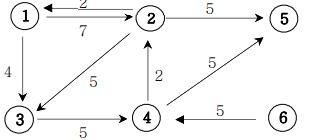

## 인접행렬(가중치 방향그래프)

아래 그림과 같은 그래프 정보를 인접행렬로 표현해보세요.

### 입력설명

첫째 줄에는 정점의 수 N(2<=N<=20)와 간선의 수 M가 주어진다. 그 다음부터 M줄에 걸쳐 연
결정보와 거리비용이 주어진다.

### 출력설명

인접행렬을 출력하세요.

### 입력예제 1

6 9 \
1 2 7 \
1 3 4\
2 1 2\
2 3 5\
2 5 5\
3 4 5\
4 2 2\
4 5 5\
6 4 5

### 출력예제 1

0 7 4 0 0 0\
2 0 5 0 5 0\
0 0 0 5 0 0\
0 2 0 0 5 0\
0 0 0 0 0 0\
0 0 0 5 0 0

### 풀이 아이디어

- 방향 그래프:간선중 방향이 설정되어 있는 것
- 가중치 방향그래프: 간선의 값까지 설정이 되어있는 경우
- 무방향 그래프: 방향이 정해져 있지 않은 그래프

- 그래프 설정하는 방법:
  graph[a][b] = c 방식으로 설정해준다.
  이때 그래프는 0으로 초기화 시켜준다.
