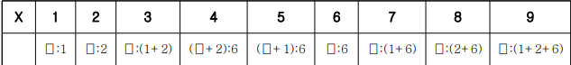

## 양팔저울
무게가 서로 다른 K개의 추와 빈 그릇이 있다. 모든 추의 무게는 정수이고, 그릇의 무게는 0
으로 간주한다. 양팔저울을 한 번만 이용하여 원하는 물의 무게를 그릇에 담고자 한다.
주어진 모든 추 무게의 합을 S라 하자. 예를 들어, 추가 3개이고, 각 추의 무게가 {1, 2, 6}이
면, S=9이고, 양팔저울을 한 번만 이용하여 1부터 S사이에 대응되는 모든 무게의 물을 다음과
같이 그릇에 담을 수 있다. X는 그릇에 담는 물의 무게이고, ⎕은 그릇을 나타낸다.

\
만약 추의 무게가 {1, 5, 7}이면 S=13이고, 그릇에 담을 수 있는 물의 무게는 {1, 2, 3, 4, 5,
6, 7, 8, 11, 12, 13}이고, 1부터 S사이에서 무게에서 9와 10에 대응하는 무게의 물을 담을
수 없다.
K(3<=K<=13)개의 추 무게가 주어지면, 1부터 S사이의 정수 중 측정이 불가능한 물의 무게는
몇 가지가 있는 지 출력하는 프로그램을 작성하세요.

#### ▣ 입력설명
첫 번째 줄에 자연수 K(3<=K<=13)이 주어집니다.
두 번째 줄에 K개의 각 추의 무게가 공백을 사이에 두고 주어집니다. 각 추의 무게는 1부터
200,000까지이다.
### ▣ 출력설명
첫 번째 측정이 불가능한 가지수를 출력하세요.
### ▣ 입력예제 1
3\
1 5 7
### ▣ 출력예제 1
2

### 문제 해결 과정(문제 못품)
마지막 모든 추의 개수를 구하고 전체S에서 측정 가능한 추의 개수를 출력하면 된다.

- 측정 가능한 추를 어떻게 받아오느냐:\
3가지 방향으로 길을 뻗어나가게 되는데, 추의 왼쪽에 올려놓는경우, 추의 오른쪽에 올려놓는 경우, 아무것도 올리지 않은 경우 이렇게 3가지로 진행하게 된다.

### 주의 부분
dfs진행할때 for문으로 넣어주는 것이 아닌, 현재 레벨에 대한 원소를 data에 넣어줘야 한다.
